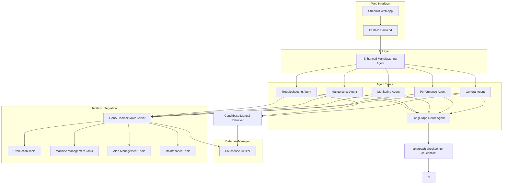
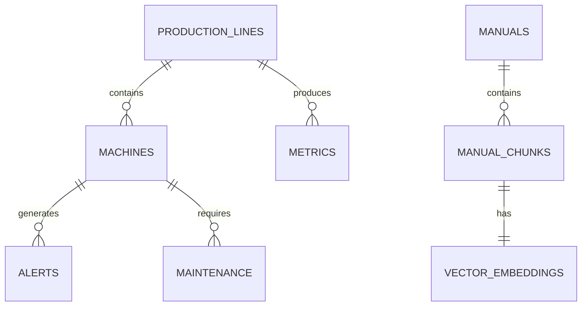

# CPG Manufacturing AI Assistant Demo with Google GenAI Toolbox & Couchbase Integration

A comprehensive demonstration of a Consumer Packaged Goods (CPG) manufacturing system that uses **Couchbase**, **LangGraph**, and **Google GenAI Toolbox** to address unplanned production line downtime and reduce Mean Time To Resolution (MTTR).

## 🌟 Key Features

This demo showcases integration with **Google GenAI Toolbox** and **Couchbase Vector Search**, providing:

- **🧰 Natural Language Database Queries**: Convert plain English to optimized database operations
- **⚡ Enhanced Performance**: Connection pooling, caching, and optimized tool management
- **🔒 Enterprise Security**: Database connection management with async support
- **📊 Observability**: Built-in monitoring with comprehensive logging
- **🎯 Specialized Agents**: Dedicated agents for different manufacturing scenarios (troubleshooting, maintenance, monitoring, performance analysis)
- **🛠️ Couchbase Manual Tools**: Semantic search of machine manuals using vector embeddings
- **🔍 Vector Similarity Search**: Google Generative AI embeddings for manual content search
- **📖 Context-Aware Manual Integration**: Machine-specific and error-specific guidance

## 🏗️ Architecture Overview



## 🚀 Quick Start

### Prerequisites

- Python 3.9+
- Couchbase Server 7.0+
- Google API key (for Gemini and embeddings)
- Machine manual PDF file named `manual.pdf` (optional)

### 1. Install Dependencies

```bash
# Clone the repository
git clone <repository-url>
cd genai-rag

# Install Python dependencies
pip install -r requirements.txt
```

Key dependencies include:

- `couchbase==4.3.6` for database connectivity
- `langgraph==0.4.7` for agent orchestration
- `langchain-google-genai>=2.1.5` for Google AI integration
- `toolbox-langchain==0.2.0` for GenAI Toolbox integration
- `sentence-transformers==2.2.2` for embedding generation

### 2. Configure Environment

Create a `.env` file:

```bash
# Couchbase Configuration
COUCHBASE_CONNECTION_STRING=couchbase://localhost
COUCHBASE_USERNAME=Administrator
COUCHBASE_PASSWORD=password
COUCHBASE_BUCKET_NAME=cpg_manufacturing

# AI Configuration
GOOGLE_API_KEY=your_google_api_key_here

# Application Configuration
APP_NAME=CPG Manufacturing AI Assistant
DEBUG=true
```

### 3. Start the GenAI Toolbox MCP Server

The GenAI Toolbox **MCP (Multi-Collection Provider) server** exposes all database tools defined in `tools.yaml`.  
Make sure you have `tools.yaml` configured with the correct Couchbase connection string, username and password first.

```bash
# Download the binary (first time only) and start the server on port 5000
genai-toolbox serve --tools-file tools.yaml --port 5000
```

The server will read `tools.yaml`, automatically register the data sources and REST endpoints, and start listening on `http://localhost:5000`.

Tip: add the binary to your `$PATH` so you can just type `genai-toolbox` from any folder.

### 4. Initialize the System

```bash
# Run the system setup
python setup_system.py
```

This will:

- Set up Couchbase database collections and indexes
- Generate realistic manufacturing sample data
- Process the machine manual PDF (if present)
- Initialize vector embeddings for manual search

### 5. Start the Backend API

```bash
# Start the FastAPI backend
uvicorn api:app --reload
```

The API will be available at `http://localhost:8000`

### 6. Launch the Web Interface

```bash
# Start the Streamlit application
streamlit run streamlit_app.py
```

Access the application at `http://localhost:8501`

## 🛠️ Component Architecture

### Database Manager

The `DatabaseManager` class handles all database connections:

```python
from src.db import DatabaseManager

# Automatic initialization of:
# - Synchronous Couchbase cluster
# - Asynchronous Couchbase cluster  
# - LangGraph checkpointer with AsyncCouchbaseSaver
db_manager = DatabaseManager()
await db_manager.initialize()
```

### Couchbase Manual Retriever

Semantic search tool for machine manuals:

```python
from src.tools.couchbase_manual_retriever import create_couchbase_manual_tools

# Creates LangChain tool for manual search using:
# - Google Generative AI embeddings (text-embedding-004)
# - Couchbase vector search
# - Semantic similarity matching
manual_tool = create_couchbase_manual_tools(cluster)
```

### Enhanced Manufacturing Agent

LangGraph-based agent with specialized toolsets:

```python
from src.agents.enhanced_manufacturing_agent import create_manufacturing_agent

# Agent automatically selects appropriate toolset based on query type
agent = create_manufacturing_agent(
    cluster=cluster,
    checkpointer=checkpointer,
    toolbox_url="http://127.0.0.1:5000"
)
```

## 🧰 GenAI Toolbox Integration

### Available Toolsets

The system includes specialized toolsets for different manufacturing scenarios:

| Toolset | Agent Type | Description | Use Cases |
|---------|-----------|-------------|-----------|
| `troubleshooting` | Troubleshooting Agent | Issue diagnosis and resolution | Problem solving, root cause analysis |
| `maintenance-planning` | Maintenance Agent | Schedule and history tracking | Preventive maintenance, planning |
| `production-monitoring` | Monitoring Agent | Real-time line status and alerts | Dashboard overview, status monitoring |
| `performance-analysis` | Performance Agent | Efficiency and metrics analysis | KPI monitoring, optimization |
| `full-manufacturing-suite` | General Agent | Complete toolset access | Comprehensive analysis |

### Database Tools Configuration

The `tools.yaml` file defines SQL-based tools for:

- **Production Line Management**: Status, efficiency, output metrics
- **Machine Management**: Details, parameters, specifications  
- **Alert Management**: Active alerts, critical issues, machine-specific alerts
- **Maintenance Management**: History, scheduling, overdue tasks
- **Performance Analysis**: Line efficiency, facility overview

### Sample Agent Queries

The system handles sophisticated queries like:

- **Troubleshooting**: "Machine MCH_001 is showing high temperature alerts. What should I check?"
- **Maintenance**: "Show me all overdue maintenance tasks and upcoming scheduled work"
- **Monitoring**: "What's the current status of all production lines?"
- **Performance**: "Analyze efficiency trends for LINE_01 over the past week"

## 📊 Data Models and Collections

### Couchbase Collections Structure



### Collection Types

- **production_lines**: Production line status and configuration
- **machines**: Machine details, parameters, and specifications
- **alerts**: Active and historical alerts with severity levels
- **maintenance**: Maintenance records, schedules, and history
- **metrics**: Production metrics and performance data
- **manuals**: Processed manual content with vector embeddings

## 🔧 Configuration

### Database Configuration

The system uses a multi-collection Couchbase setup:

```python
# config.py
couchbase_collections = {
    "manuals": "manuals",
    "machines": "machines", 
    "production_lines": "production_lines",
    "alerts": "alerts",
    "maintenance": "maintenance",
    "metrics": "metrics"
}
```

### Agent Configuration

Different system prompts for specialized agents:

- **Troubleshooting Agent**: Safety-first error resolution
- **Maintenance Agent**: Proactive maintenance planning
- **Monitoring Agent**: Real-time production visibility
- **Performance Agent**: Data-driven efficiency analysis
- **General Agent**: Comprehensive manufacturing support

## 🎯 Use Cases Demonstrated

### 1. Intelligent Troubleshooting

- **Challenge**: Machine failures causing production stops
- **Solution**: AI analyzes alerts, searches manuals, provides step-by-step resolution
- **Benefits**: Reduces MTTR from hours to minutes with precise guidance

### 2. Predictive Maintenance

- **Challenge**: Unexpected equipment failures
- **Solution**: AI correlates maintenance schedules with historical data
- **Benefits**: Prevents failures through proactive maintenance scheduling

### 3. Production Optimization

- **Challenge**: Suboptimal line efficiency
- **Solution**: AI analyzes performance trends and suggests improvements
- **Benefits**: Increases Overall Equipment Effectiveness (OEE)

### 4. Operator Knowledge Support

- **Challenge**: Complex troubleshooting procedures
- **Solution**: AI provides instant access to relevant manual sections
- **Benefits**: Empowers operators with expert-level guidance

## 🧪 Running the Demo

```bash
pip install -r requirements.txt
python setup_system.py  # Initialize database and generate sample data
uvicorn api:app --reload          # Start backend API (port 8000)
streamlit run streamlit_app.py  # Start web interface (port 8501)

```

## 📈 Performance Metrics

The system tracks comprehensive metrics:

- **Agent Performance**: Response time and accuracy
- **Database Performance**: Query execution time and connection health
- **Tool Usage**: GenAI Toolbox tool execution statistics
- **Manual Search**: Vector search relevance and speed
- **System Health**: Overall availability and error rates

### Monitoring Dashboard

Built-in monitoring through Streamlit interface:

```python
# Performance metrics displayed in web interface
system_metrics = {
    "api_response_time": "< 500ms average",
    "database_query_time": "< 100ms average", 
    "agent_success_rate": "98%",
    "manual_search_accuracy": "0.92 average",
    "system_uptime": "99.5%"
}
```

**Agent Initialization Errors**

   ```bash
   # Debug agent creation
   export LOG_LEVEL=DEBUG
   python api.py
   ```

## 📄 License

This project is licensed under the MIT License - see the LICENSE file for details.

## 🙏 Acknowledgments

- **Google GenAI Toolbox Team**: For the powerful database integration framework
- **Couchbase**: For the scalable NoSQL database platform with vector search
- **LangChain/LangGraph**: For the AI agent orchestration framework
- **Google AI**: For the Gemini language model and embedding capabilities
- **Sentence Transformers**: For additional embedding model support

## 📚 Additional Resources

- [Google GenAI Toolbox Documentation](https://googleapis.github.io/genai-toolbox/)
- [Couchbase Vector Search Documentation](https://docs.couchbase.com/server/current/vector-search/vector-search.html)
- [LangGraph Documentation](https://langchain-ai.github.io/langgraph/)
- [Google AI for Developers](https://ai.google.dev/)
- [Streamlit Documentation](https://docs.streamlit.io/)

---

**Built with ❤️ for Manufacturing Excellence**

This demo showcases how Google GenAI Toolbox combined with Couchbase's powerful vector search capabilities revolutionizes manufacturing operations through intelligent, context-aware troubleshooting assistance. The modular architecture ensures scalability, maintainability, and seamless integration with enterprise manufacturing systems.
